<a href="https://lookerstudio.google.com">Looker Studio</a> is a business intelligence tool that helps transform raw data into clear and interactive dashboards. Instead of analyzing data directly from spreadsheets, analysts can visualize patterns, trends, and performance indicators in a structured way.

In business environments, dashboards are used to monitor KPIs, identify problems early, and support decision-making. Before building advanced dashboards, it is important to understand how data is connected, structured, and visualized in <a href="https://lookerstudio.google.com">Looker Studio</a>.


# Data Connection

Before any visualization can be created, data must first be connected to the dashboard. <a href="https://lookerstudio.google.com">Looker Studio</a> allows analysts to integrate different types of datasets, including spreadsheets and external files. A proper data connection ensures that the dashboard reflects accurate and up-to-date information.


## Connect Google Sheets

**Google Sheets** is an online spreadsheet tool in Google Workspace. It allows users to create spreadsheets and work on them together in real time.

In <a href="https://lookerstudio.google.com">Looker Studio</a>, the Google Sheets connector lets you use data from a Google Sheets file as a data source for dashboards.

:::{.callout-note title="To connect a Google Sheet"}

1. First, log in to your Looker Studio account. Then, press **Create** → **Data Source**.
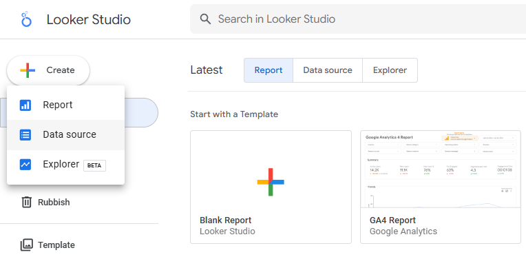


2. You will be redirected to the page with listed data sources options. Select **Google Sheets** and click **Connect.**
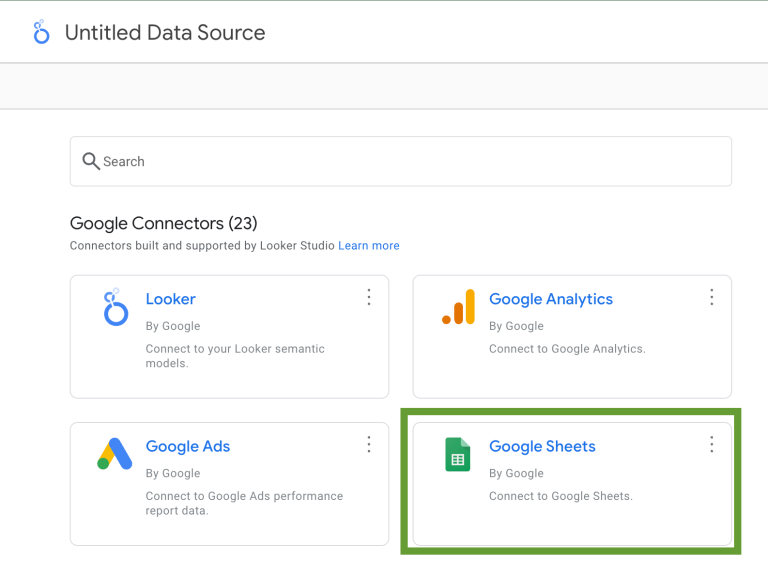


3. In the next step, select the worksheet with the data you want to visualize. You can use the search bar to find it faster.
4. Next, specify what sheet you want to connect to Looker Studio.
5. You can also select some additional settings. For example, you can choose to only include a specific range of columns if you don’t need to transfer all the data on the sheet.

Once this is done, click **Connect.**

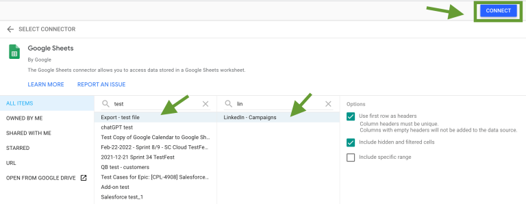

6. After this, you can review your data – in our example, it’s the list of dimensions from a LinkedIn Ads report. At this step, you can check that all the fields are assigned the correct data type, such as text, number, or date and time. If something is wrong, you can change the data type manually.

7. When everything is ready, click **Create Report.**
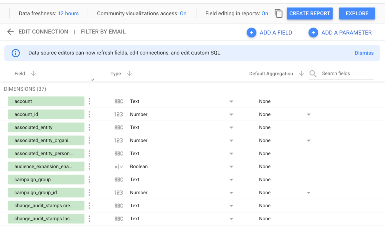

8. Now, you’ve connected Google Sheets to Looker Studio and can start working on your dashboard.
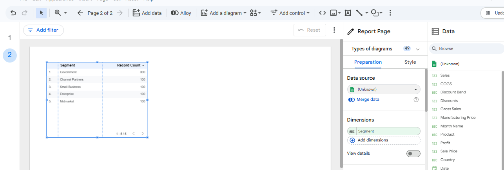

:::

Using this method, you can make your Google Sheets spreadsheet with the source data self-updating, so that it always contains only the latest data to be displayed in your dashboard. 


## Import Excel / CSV Files

In some situations, data may come from external systems in Excel or CSV format. These files can also be used in <a href="https://lookerstudio.google.com">Looker Studio</a> after being uploaded or converted.

:::{.callout-note title="To import a Excel"}

1. Go to the Looker Studio homepage and log in with your credentials.
2. Click the **Create** icon and select **Data Source.**
3. Choose the **Microsoft Excel** connector from the list of available connectors.
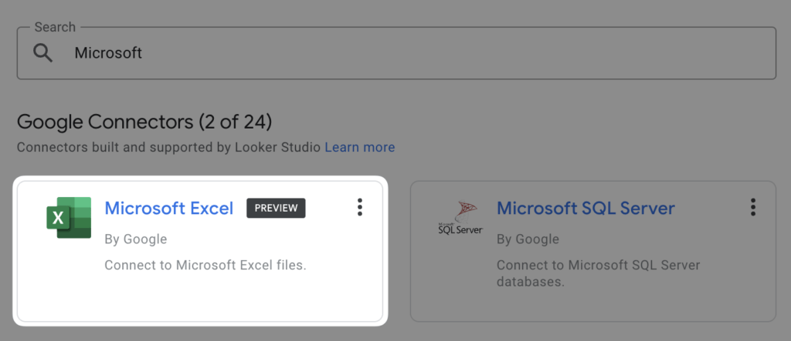

4. Browse and select the Excel file you want to connect.
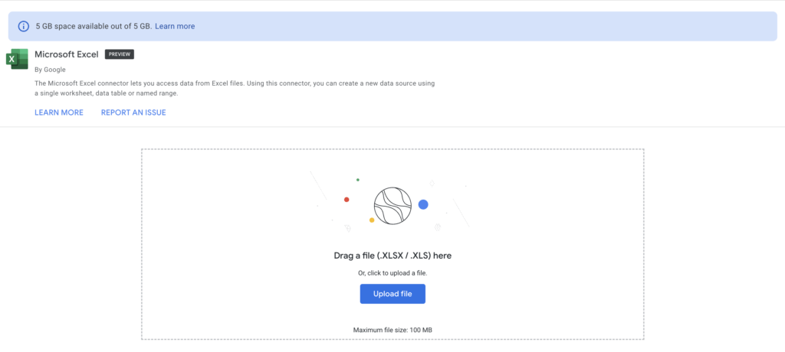

5. Configure Data Source Options
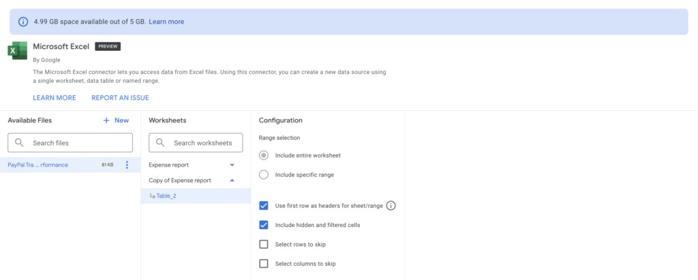

6. Click **CONNECT** in the upper right to link your data source to Looker Studio.

7. At this step, you can check that all the fields are assigned the correct data type.
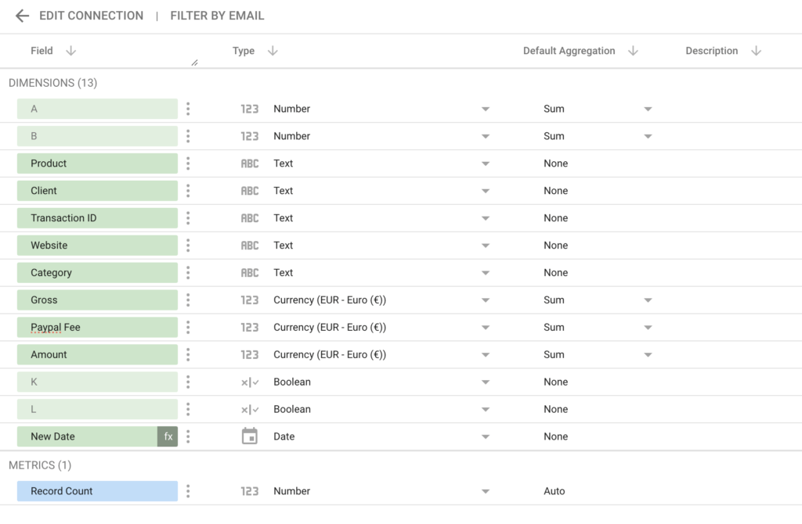

8. Set the data credentials to **Data Credentials** → **Owner Credentials** so anyone with the link to your report can view the data.

9. Click **CREATE REPORT** to start building visualizations using your newly connected Excel data.
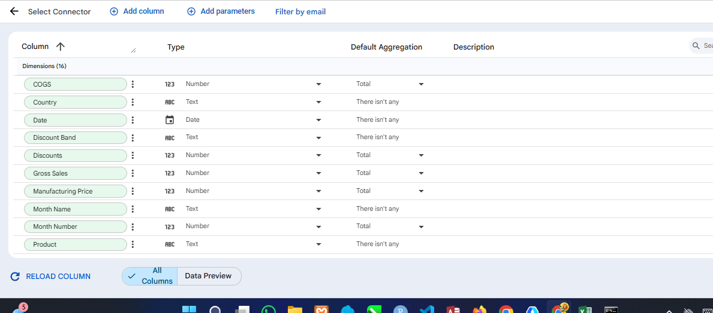


:::


# Data Structure

Understanding how data is structured is essential before building visualizations. In <a href="https://lookerstudio.google.com">Looker Studio</a>, every dataset is composed of fields that represent either **descriptive information** or **numerical values.**


 
## Metrics vs Dimensions

In Looker Studio, you need metrics and dimensions to create meaningful reports. Your dataset must have at least one of these metrics for your visualizations to provide insight.

So, what are the metrics and dimensions in Looker Studio?

**Metrics** are numerical values that measure or calculate. These values come from the *implicit* or *explicit* application of aggregation functions, such as `COUNT()`, `SUM()`, `AVG()`, etc.

Suppose you want to create a product sales report. You can choose the following metrics:

- Sales revenue from selling your products online
- Number of customers who purchased your products
- Maximum sales
- Minimum sales
- Average product price

:::{.callout-note title="Dimensions"}
*Dimensions* are the names, descriptions, or other characteristics of the things you measure or calculate. There are many ways to view your metrics. And, with dimensions, you can analyze your data from various perspectives.
:::

:::{.callout-tip title="Metrics"}
Try breaking down your metrics to see if there is anything else you need to know by using phrases such as “broken down by,” “per,” “for each,” etc.
:::

See the bold text in the following list for examples of dimensions:

- Sales revenue from your online product sales, broken down by sales per **month** or per **order type **
- Number of customers by **country of origin**, as well as their **age**, **gender**, and **the type of device they use**.
- **Product names** with maximum sales
- **Days of the week** with minimum sales
- Average product price per **product type**

Before you create a report in Looker Studio, you must prepare your dataset and dashboard layout. This includes determining which metrics are important for your report or dashboard so that they can be displayed in columns, rows, or charts.


## Aggregation Logic

Aggregation is the process of summarizing or reducing tabular data into a simpler form. In other words, aggregation takes many rows of data and combines them into a single value that represents the overall result.

For example, consider the following list of numbers:
> 100, 200, 300, 400, 500

From this list, we can calculate several aggregated values.

| **Fact**                          | **Aggregation** |
| --------------------------------- | -----------     |
| There are 5 numbers               | Count           |
| The smallest number is 100        | Minimum         |
| The largest number is 500         | Maximum         |
| The average of the numbers is 300 | Average         |
| The sum of the numbers is 1500    | Sum             |

Aggregation can also be performed using other statistical calculations such as median, count distinct, quartiles, and percentiles.

In data analytics, aggregation helps analysts summarize large datasets and extract meaningful insights.


### Dimensions and Aggregation

The previous example only used a simple list of numbers. However, real-world data usually contains dimensions and metrics.

- **Dimensions** are attributes that categorize or group data.
- **Metrics** are numerical values that measure the data.

In Looker Studio, **aggregation always happens within the context of dimensions**.

A dataset can be aggregated in three different ways:

1. Using all dimensions. This shows the raw data.
2. Using some dimensions. This groups the data based on selected categories.
3. Using no dimensions. This produces a summary of the entire dataset.

**Example Dataset**

Below is an example dataset representing stock prices.

| **Date**     | **Ticker** | **Price** |
| ------------ | ---------- | --------- |
| January 1    | GOOG       | 100       |
| January 1    | AAPL       | 200       |
| January 2    | GOOG       | 300       |
| January 2    | AAPL       | 400       |
| January 3    | GOOG       | 500       |

In this dataset:

- **Date** and **Ticker** are dimensions.
- **Price** is a metric.


### Aggregating Data by Dimension

We can group the data using different dimensions.

**Grouped by Ticker**

| Ticker | Price |
| ------ | ----- |
| GOOG   | ?     |
| AAPL   | ?     |

**Grouped by Date**

| Date      | Price |
| --------- | ----- |
| January 1 | ?     |
| January 2 | ?     |
| January 3 | ?     |

The value of the metric depends on which aggregation method we apply.

---

If we calculate the average price for each company, we apply the **Average aggregation** together with the **Ticker dimension**.

| Ticker | Average of Price            |
| ------ | --------------------------- |
| GOOG   | (100 + 300 + 500) / 3 = 300 |
| AAPL   | (200 + 400) / 2 = 300       |


---

If we want to know how many companies have stock data on each day, we use the Date dimension and the Count aggregation.

| Date      | Count of Price |
| --------- | -------------- |
| January 1 | 2              |
| January 2 | 2              |
| January 3 | 1              |


---

If we use both Date and Ticker as dimensions, the aggregation result will look like this:

| Date      | Ticker | AVG(Price) | SUM(Price) |
| --------- | ------ | ---------- | ---------- |
| January 1 | GOOG   | 100        | 100        |
| January 1 | AAPL   | 200        | 200        |
| January 2 | GOOG   | 300        | 300        |
| January 2 | AAPL   | 400        | 400        |
| January 3 | GOOG   | 500        | 500        |

When all dimensions are included, the aggregated result becomes **identical to the original data**. This is technically still aggregation, but it does not change the data because each row forms its own group.


### Aggregation in Looker Studio

In Looker Studio, aggregation can be applied in several ways:

1. In the data source. Each field can have a default aggregation method.
2. In a chart. Report editors can override the default aggregation for specific charts.
3. In calculated fields. Aggregation functions can be used in formulas to create new metrics.

**Default Aggregation Methods**

Looker Studio provides several aggregation methods that can be applied to fields.

| Aggregation Method | Abbreviation | Description                                                            |
| ------------------ | ------------ | ---------------------------------------------------------------------- |
| Sum                | SUM          | Adds all values together                                               |
| Average            | AVG          | Calculates the average value                                           |
| Count              | CT           | Counts each value                                                      |
| Count Distinct     | CTD          | Counts only unique values                                              |
| Min                | MIN          | Returns the smallest value                                             |
| Max                | MAX          | Returns the largest value                                              |
| Auto               | AUT          | Aggregation is defined by the underlying dataset and cannot be changed |
| None               |              | No aggregation is applied; the field behaves like a dimension          |


In most reports, the default aggregation for metrics is Sum.


# Chart Basics

Charts help transform numerical data into visual insights. Instead of reading rows of numbers, users can quickly identify patterns, comparisons, and trends.


## Basic Chart Types

Charts are an important component in Looker Studio because they turn raw data into visual information that is easier to understand.

Charts display **metrics (numerical values)** and **dimensions (data categories)** to help users see patterns, comparisons, and trends.

To add a chart, click **Add a Chart**, choose the chart type, place it on the canvas, and then set the **metrics and dimensions** for the visualization.

---

Looker Studio provides many visualization options that allow analysts to explore data from different perspectives. Some commonly used charts include:

- Scorecard
- Bar Chart
- Pie Chart
- Geo Chart
- Area Chart
- Time Series
- Line Chart
- Bubble Chart
- Tree Map

Each chart type serves a different purpose depending on the analysis that you want to perform.


### Scorecard

A scorecard represents your data project’s key results, KPIs, and other metrics. It can visualize progress over time and provide a quick snapshot of key indicators.

To create a scorecard on Looker Studio, click “add a chart on your dashboard.” On the dropdown menu, click Scorecard.

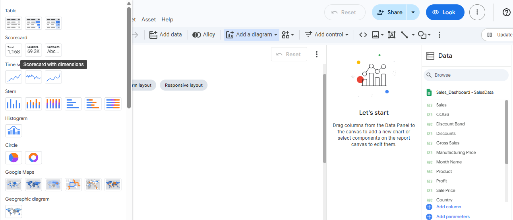

You can easily change the dimensions or metrics you want to visualize

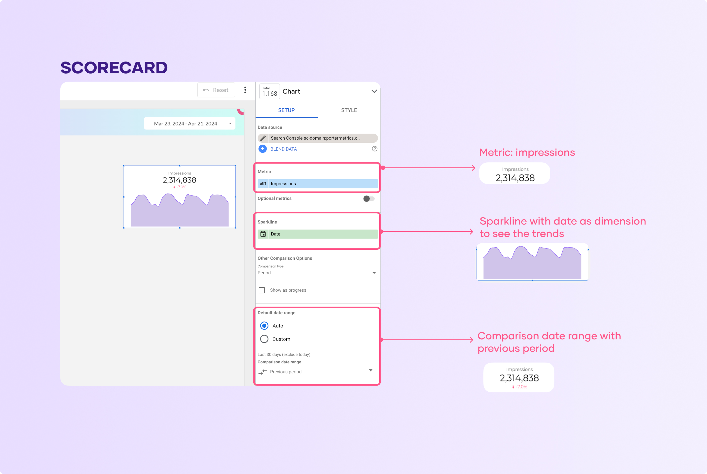

You can add a sparkline or other comparison options to add context, such as trends, or compare with a specific metric.

This is an example of a <a href="#">marketing and sales metrics map</a> made using scorecards and custom images.

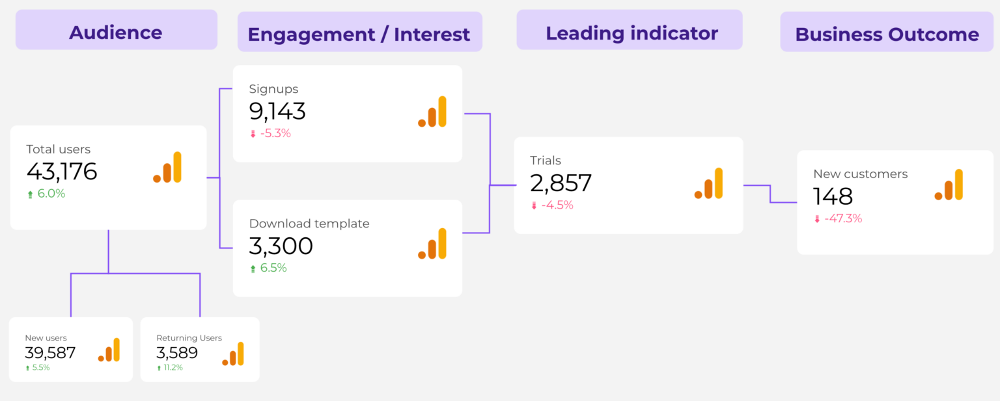

A variation of the scorecard is the gauge chart. The main difference is that Gauge charts are better at tracking the performance of the metric vs. a goal or benchmark.


### Bar Chart

Bar charts display data similar to graphs. They are used to compare the relationship between two or more variables using rectangular bars, as shown below.

**Adding a bar chart follows a similar process.**

1. Click on “add a chart,” then choose a bar chart.
2. Depending on how you want to visualize your data, you can choose a stacked bar chart, 100% stacked bar chart, or stacked column chart.

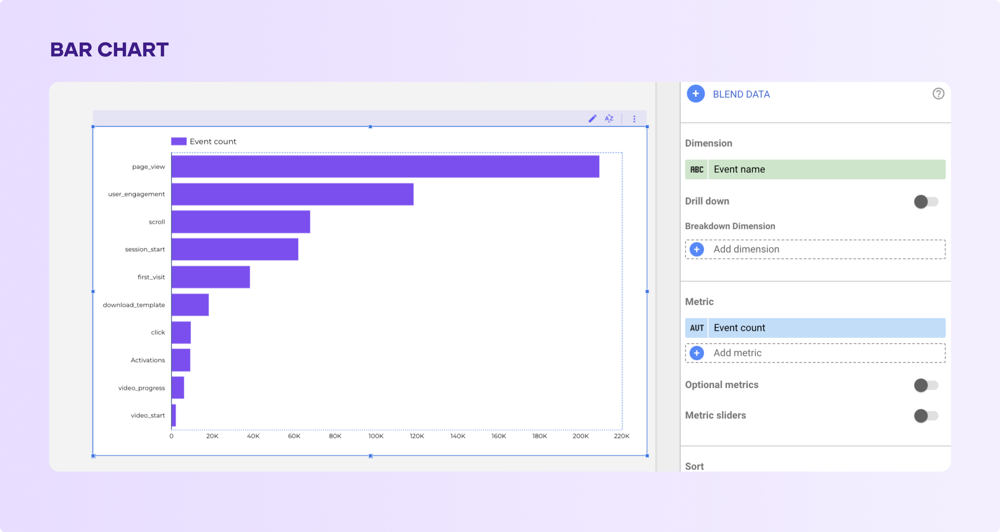

3. Add it to your report and select the metrics at least one dimension and metrics.

Let’s examine each of them.


### Pie Chart

The next type of chart on Looker Studio is the pie chart. They are a popular means of visualizing data. Pie charts are circular charts that show the percentages of data represented in the chart.

**To add a pie chart:**

1. Click on the pie chart in the drop-down menu after clicking “Add a chart.”
2. On Looker Studio, pie charts are visualized in two ways; regular pie charts and donut pie charts.
3. Add them to your page, Looker Studio will suggest automatically the metric and dimension

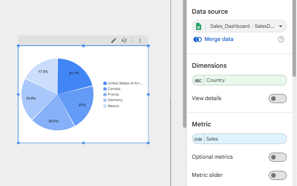

Remember you can change the metric and dimension. For this example, I selected country as dimension and sessions as the main metrics.

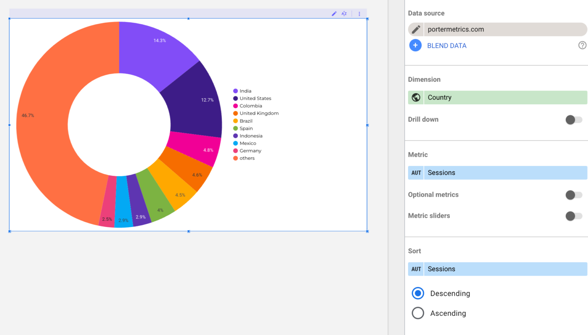

This is the donut pie chart, it’s very similar to the regular pie chart but I think the donut is better.

:::{.callout-tip title="Tip"}
If your pie charts have more than 5 variables, consider using a column chart instead; it’s easier to read.
:::


### Geo Chart

**Google Maps** visualizations can also be used in **Looker Studio**. The platform provides several map types, including **bubble maps, filled maps, heat maps, and line maps**.

To add one, click **Add a Chart**, go to the **Google Maps** section, and select the map type you want to display on your dashboard.

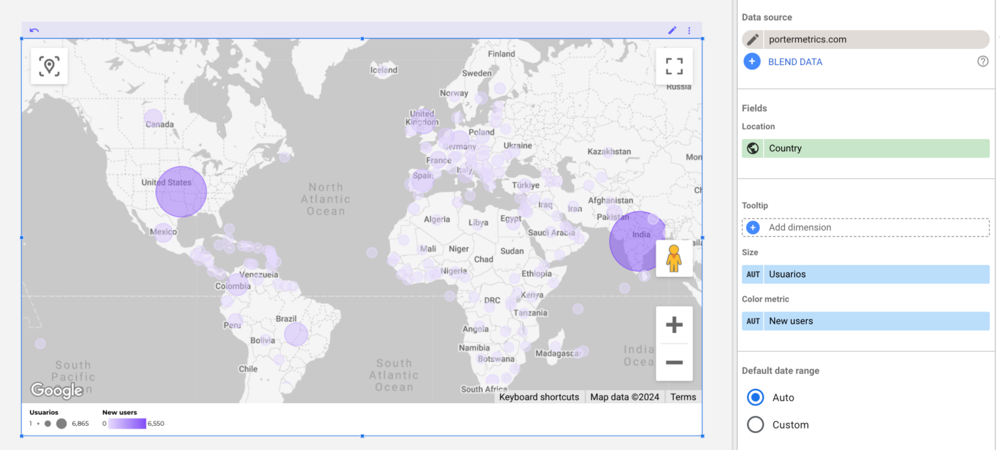


### Area Chart

Area charts are used to show data trends over time. This chart usually displays one dimension and one metric to help users see changes in values.

In Looker Studio, there are three types of area charts that can be used to visualize data.

#### Area Chart

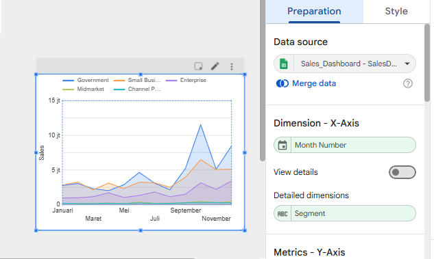

#### Stacked area charts

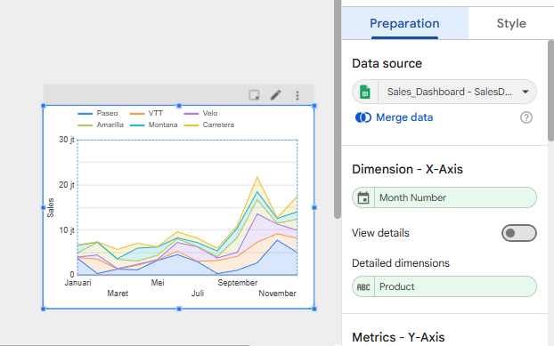

#### Area Chart

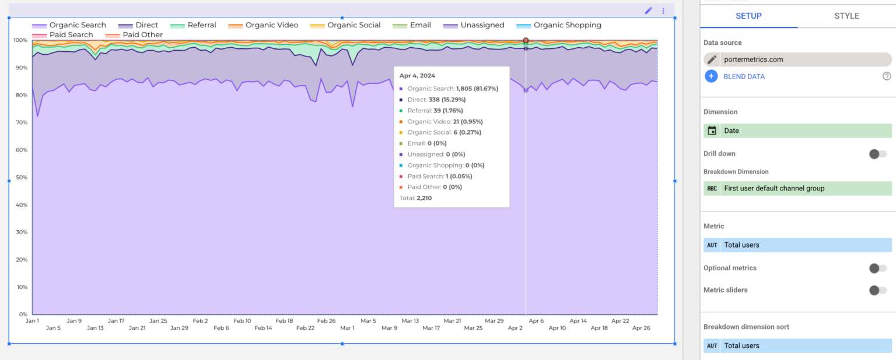


### Time Series

Time series charts are used to display data trends over a specific period of time.

In Looker Studio, there are several options for creating time series visualizations, including the standard time series chart.


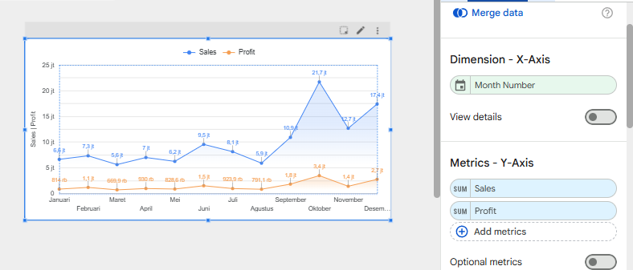


This example shows how user traffic changes from September to November.

In Looker Studio, you can also use a Sparkline time series. This small chart shows the trend of a metric over time.

Sparkline charts are often combined with a scorecard, so users can see both the current value and its trend at the same time.


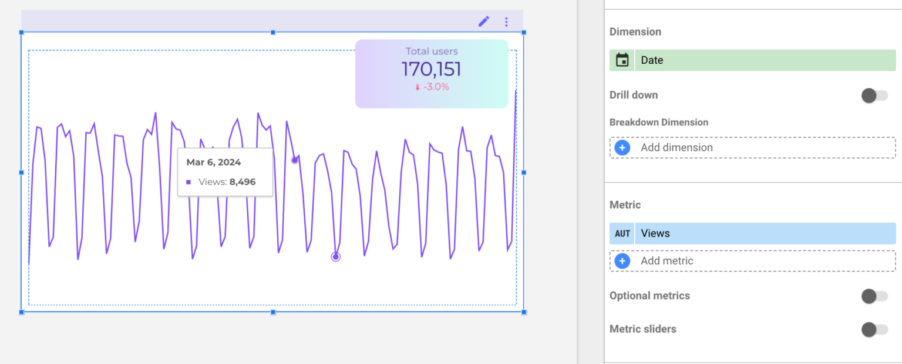


Another type of time series chart in Looker Studio is the smoothed time series. It works similarly to the regular time series, but it allows you to **add a comparison period** in the **Setup tab** to compare trends between different time ranges.


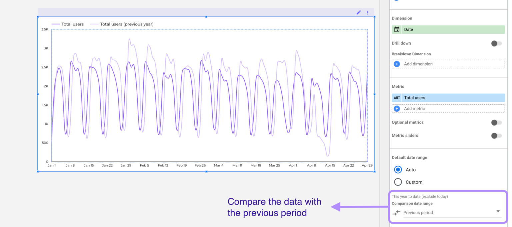


In this chart, the trend is shown with smoothed lines instead of sparklines. There is no strict rule about which type to use when creating reports.

In Looker Studio, you can also enable the Cumulative option in the Style tab to compare accumulated data with the previous period.


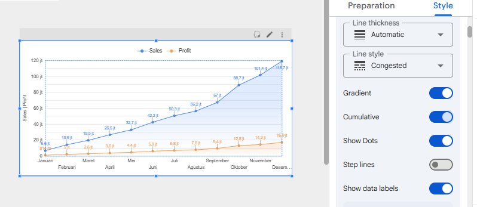


In this case, the goal is to compare the same time period with the previous one to clearly see whether the number of new users is increasing or not.


### Line Chart

This is another simple chart available in Looker Studio. It is used to compare three or more variables.

There are four ways to create a line chart. The first option is a basic line chart.


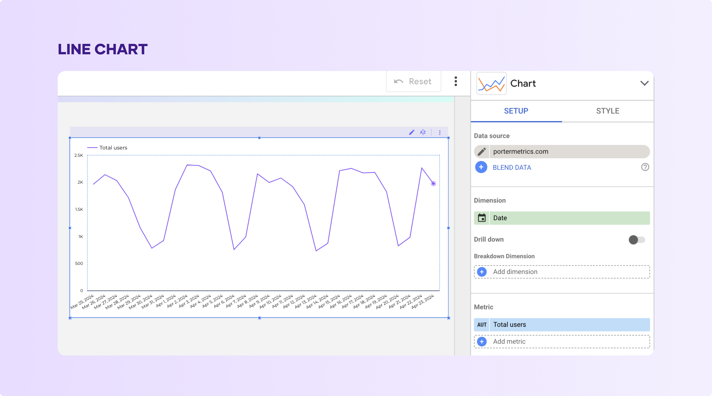


Another option is the smoothed line chart, which works the same as a regular line chart but with a smoother visual appearance.

In Looker Studio, you can also use a combo chart, which combines line charts and bar charts in one visualization.


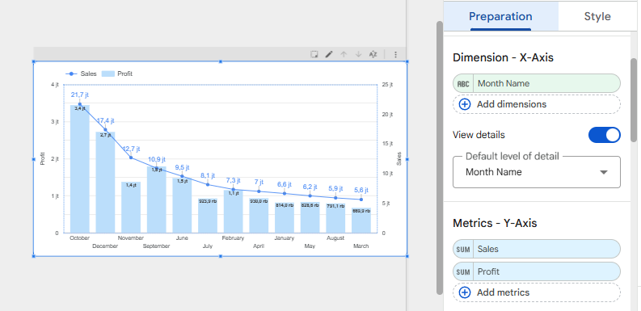

The type of line chart you use depends on the data you want to visualize and the level of detail needed.


### Bubble Chart

A bubble chart is a type of scatter chart used to analyze the relationship between three variables.

The data points appear as bubbles scattered across the chart, which is why it is called a bubble chart.

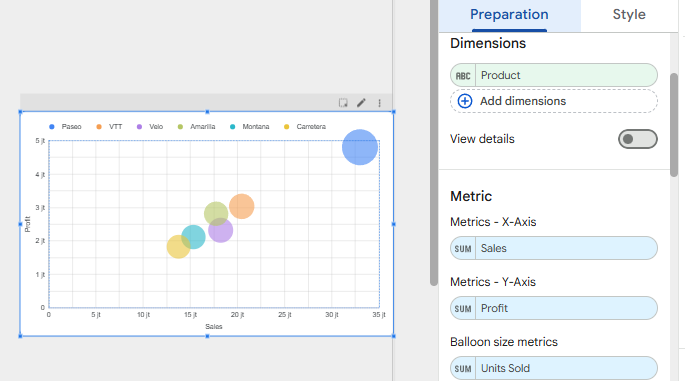

This bubble chart shows the relationship between users and conversions by country.

For example, the United States appears as the largest bubble and is positioned high on the y-axis, which means it has both the highest number of users and conversions.

In Looker Studio, you can also adjust the bubble size and colors to make the chart clearer for readers.


### Tree Map Chart

Treemaps are used to visualize hierarchical data using nested rectangles on a dashboard.

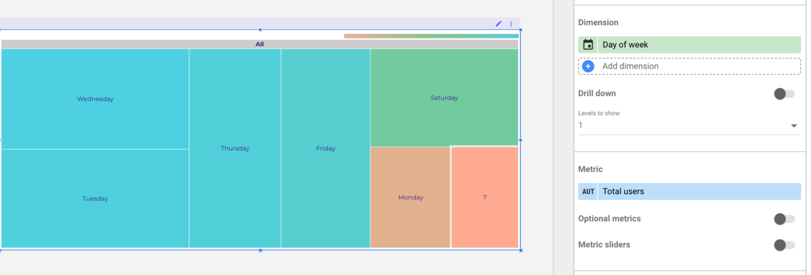

In this chart, blue days represent the highest number of visitors, while green and orange days show fewer visitors. The larger squares indicate more visitors, while smaller squares represent fewer visitors.


## Chart Configuration

In **Looker**, visualizations can be customized using the <a href="#">Chart Config Editor</a>. This tool allows users to modify chart formatting using JSON configuration based on the <a href="#">Highcharts API</a>.

It is mainly used to customize **column, bar, line, and other Cartesian charts**. With this editor, users can adjust chart elements that are not available in the standard settings.

---

To use the Chart Config Editor, the user must have the <a href="#">can_override_vis_config permission</a>. Without this permission, the editor cannot be accessed.

Once the permission is available, the editor can be opened while working with a visualization.

To customize a visualization with the Chart Config Editor, follow these steps:

1. View a visualization in an Explore, or edit a visualization in a Look or dashboard.
2. Open the **Edit** menu in the visualization.
3. Click the **Edit Chart Config** button in the **Plot** tab. Looker displays the **Edit Chart Config** dialog.

:::{.callout-tip}

The **Chart Config (Source)** pane contains the original JSON of your visualization and cannot be edited.

The **Chart Config (Override)** pane contains the JSON that should override the source JSON. When you first open the **Edit Chart Config** dialog, Looker populates the pane with some default JSON. You can start with this JSON, or you can delete this JSON and enter any valid HighCharts JSON.

:::

4. Select the Chart Config (Override) section and enter some valid HighCharts JSON. The new values will override any values in the Chart Config (Source) section.

:::{.callout-note}

See the <a href="https://api.highcharts.com/highcharts/chart"> HighCharts API documentation</a> section for examples of valid HighCharts JSON.

Looker accepts any <a href="https://www.w3schools.com/js/js_json_datatypes.asp">valid JSON values</a>. Looker does not accept functions, dates, or undefined values.
Click <> (Format code) to allow Looker to properly format your JSON.

:::

5. Click **<> (Format code)** to allow Looker to properly format your JSON.
6. Click **Preview** to test your changes.
7. Click **Apply** to apply your changes. The visualization will be displayed using the custom JSON values


After customizing a visualization in Looker, you need to save the changes. If the chart is created in Explore, <a href="#">save the Explore</a>. If it is in a **Look or dashboard**, click **Save**.

If the JSON code is invalid, Looker will show an `Invalid JSON detected` error. You can fix it using the **Autofix option** in the **Chart Config (Override) panel**.

:::{.callout-warning title="Caution"}

After making changes in the Chart Config Editor in Looker, avoid editing the default visualization settings. Doing so may cause unexpected results, such as blank charts.

:::


### Conditional Formatting

The Chart Config Editor in Looker supports most valid Highcharts JSON configurations. It also includes a `series formatters` feature that allows users to apply custom style rules to chart data.

The `series formatters` attribute uses two main options:

- select → defines which data values will be affected using a logical condition

- style → defines how the selected values will be formatted using JSON settings

For example, a rule can be created to color data values orange when the value is greater than or equal to 380.

```
{
  series: [{
    formatters: [{
      select: 'value >= 380',
      style: {
        color: 'orange'
      }
    }]
  }]
}
```

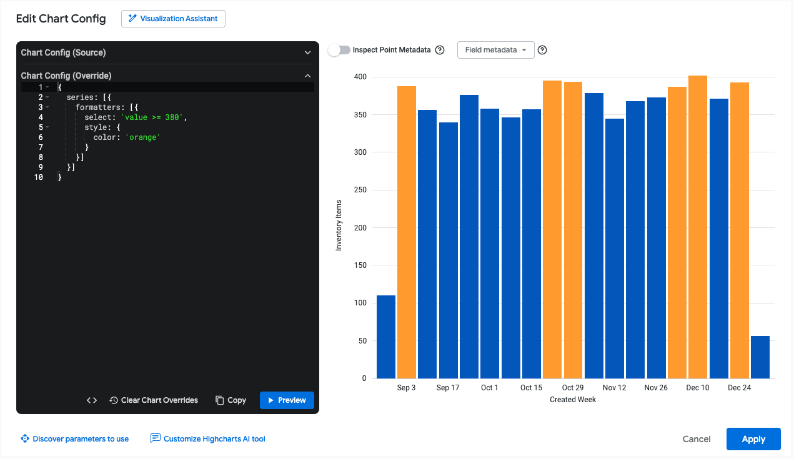

```{r, echo=FALSE, message=FALSE, warning=FALSE}

knitr::include_url("https://youtube.com/embed/4T6dvPwCcoA?si=dj4ZvTZtEJHyt68v")

```


