 
 
In <a href="https://lookerstudio.google.com">Looker Studio</a>, interactivity helps stakeholders quickly focus on the information that matters most. This is especially useful when analyzing trends, comparing categories, or investigating performance across different segments.

By adding filters and navigation controls, dashboards become tools for data exploration, not just data display.
 
 
 
# Time Filtering

Time filtering allows users to analyze data within a specific time period. This is important for identifying trends, seasonal patterns, or performance changes over time.

<a href="https://lookerstudio.google.com">Looker Studio</a> provides built-in date filtering tools that make it easy for users to adjust the time range without modifying the dataset.

## Date Range Filter

The Advanced Date Functionality is available in the date picker in Looker Studio.

This feature helps users combine marketing data from sources like **Google Analytics**, **Google BigQuery**, **Google Ads**, and **Spreadsheet**s. It also allows teams to create reports, visualize results, and collaborate on dashboards using access permissions.

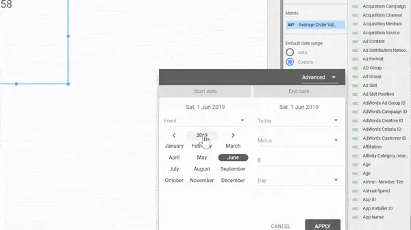

1. Open the report that you want to give a rolling timeframe.
2. Click on **Edit.**

Next, create a chart that matches the selected time range. Add a time series chart in Looker Studio to view data based on different date ranges.

3. To do this, click **Add as chart** and select **Time series chart**.

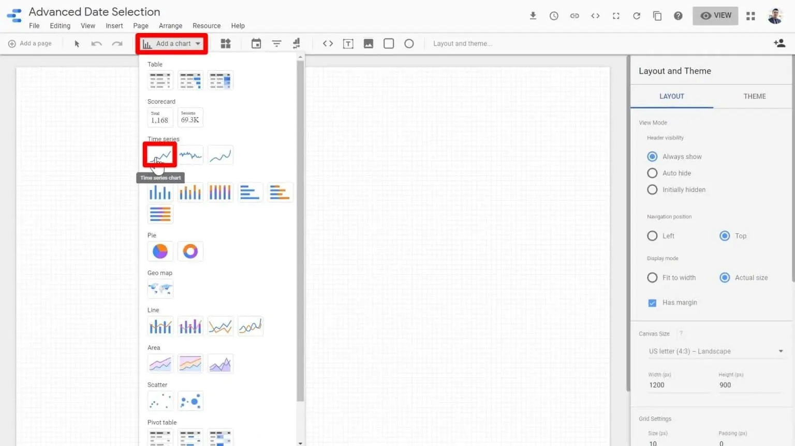

On the Looker Studio space, the time series chart will be displayed.

4. By default, charts in Looker Studio use the **Auto** date range, which displays data from the last 28 days.

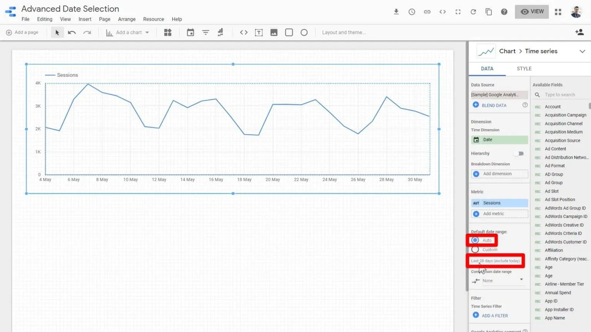

5. However, Looker Studio provides several options to customize the date range. You can choose a different time period by selecting **Custom** default date range.

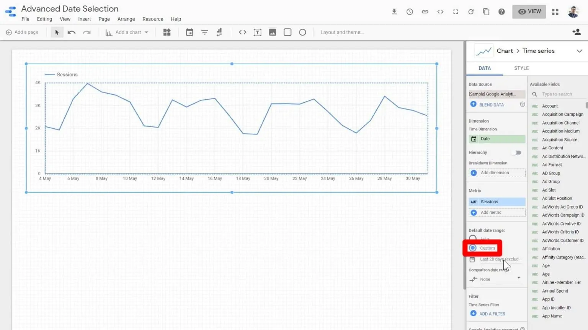

6. Next, open the date range selector under the Custom date range option in Looker Studio to see the available date range options.

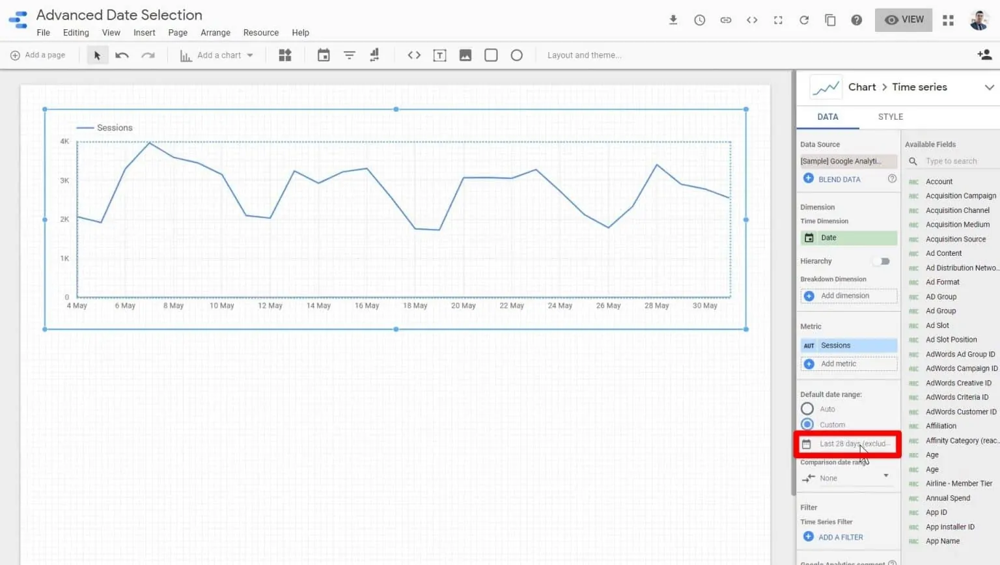

7. Then, click the date range dropdown menu in the top-right corner of the window in Looker Studio.

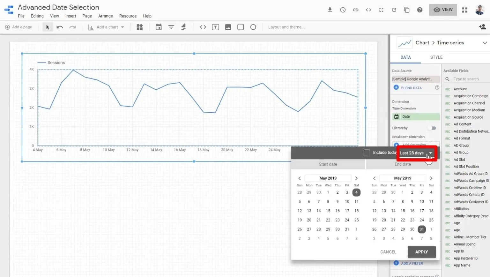

8. In Looker Studio, the dropdown menu provides several date options. One of them is **Fixed**, which allows you to set a specific start date and end date.

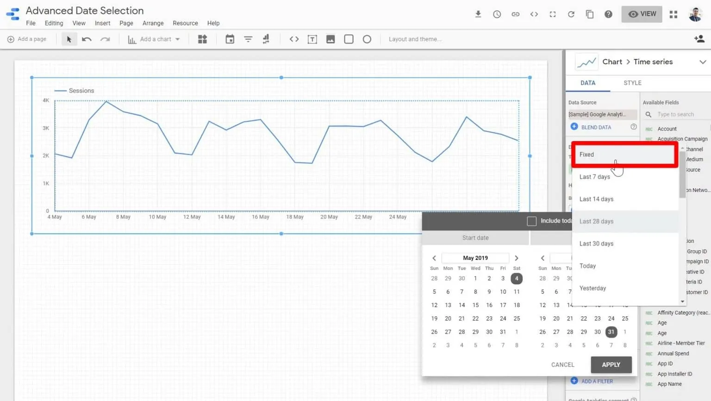

Instead of showing the last 28 days, you can set a fixed range, for example May 1 to May 14.

9. After choosing the date range in Looker Studio, click **Apply.**

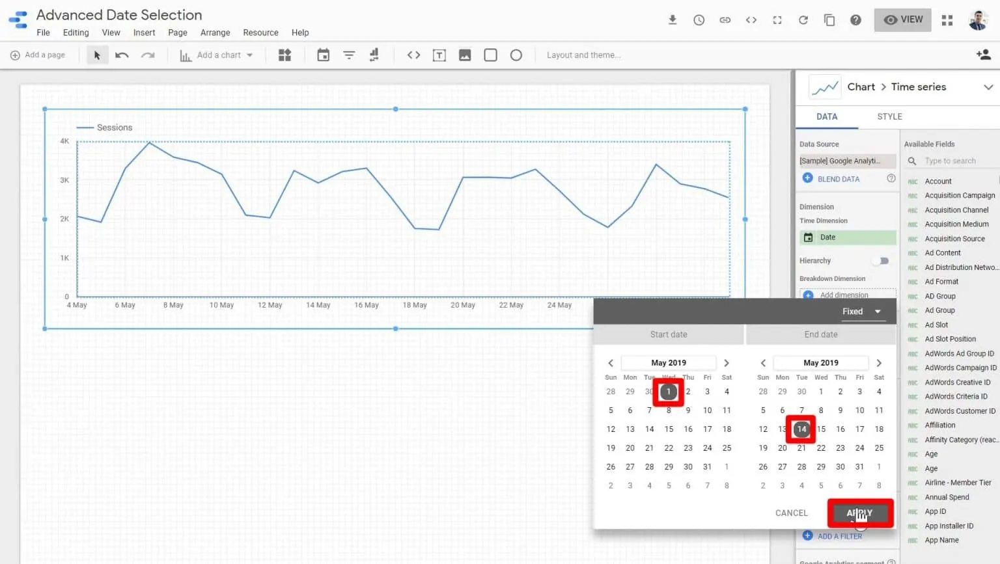

10. Click on **View** to see a preview of the date range selected.

Regardless of the date when the end-user accesses this chart and views this report, they’re always going to see the report from the first of May to the 14th of May.

**Rolling Time Frame with Dynamic Dates**

The Fixed date option is static, but Looker Studio also provides dynamic date options based on when the report is opened.

These options include last 7, 14, 28, or 30 days, as well as last calendar week, month, quarter, or year.

Sometimes we need more flexible date ranges that are not available in the standard options in Looker Studio.

For example, showing data from two months ago until two weeks ago, the week before yesterday, or the last three weeks excluding the current week.

To create these kinds of ranges, we need to use the Advanced date settings to customize a rolling timeframe.

# Category Filtering

A filter in Looker Studio controls which data appears in charts, tables, and reports. Multiple filters can be applied within the same report.

Filters are different from controls. A filter is static and can only be set in edit mode, while a control is dynamic and can be used by viewers to interact with the report.

## Create Filter

**Open the filter editor**

- From the top menu: **Resources** > **Manage Filters** > **Add a filter**
- Or directly from a visualization in your report: **Add filter**

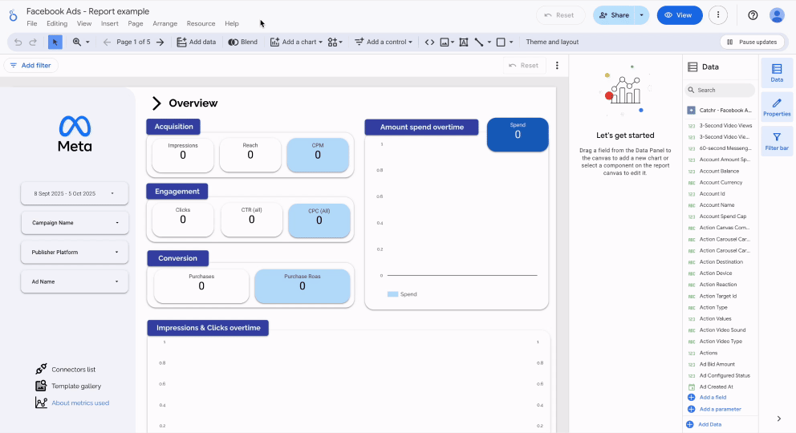

**Define the filter conditions**

When creating a filter in Looker Studio, you need to choose the filter name, data source, include or exclude option, and the field to apply it to.

You can also add **multiple conditions** using logical operators:

- **AND** → all conditions must be true
- **OR** → at least one condition must be true

Examples of filters:

- Display only campaigns that start with “SEARCH.”

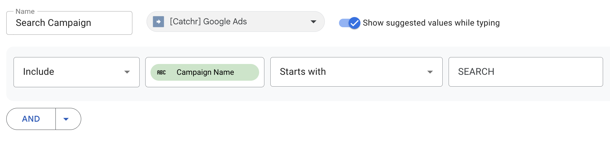

- Exclude “(not set)” values from the Source dimension.

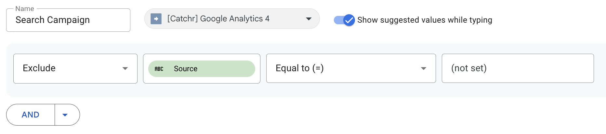

## Add Filter

There are three ways to apply a filter in Looker Studio.

**At the report level**

If you apply a filter at the report level, it will affect all pages and all visualizations.

- Click **File** > **Report Settings**
- In the right panel, click **Add filter**
- Choose your filter

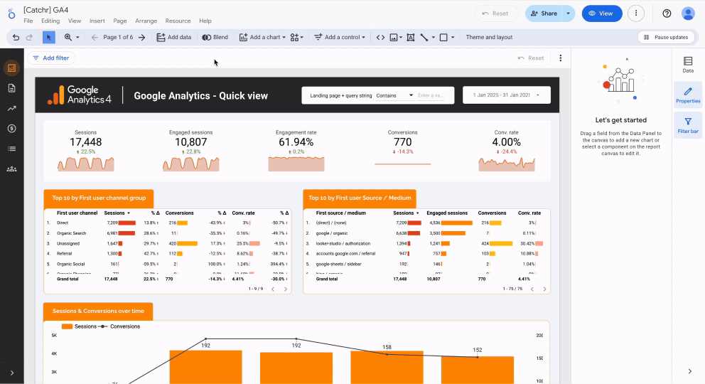

 
## Drop-down Filter

A drop-down list filter is a compact menu from which Looker users can select one or multiple values. It’s great for dimensions with numerous values, such as campaign names or countries. 

Marketers can choose specific campaigns to view performance metrics, focusing on areas of interest without being overwhelmed by a range of irrelevant data points from other performance channels.

### Create a Drop-down Filter

1. **Open the Control Menu**

Go to the top toolbar in Looker Studio and click **Add a control** > **Drop-down list**

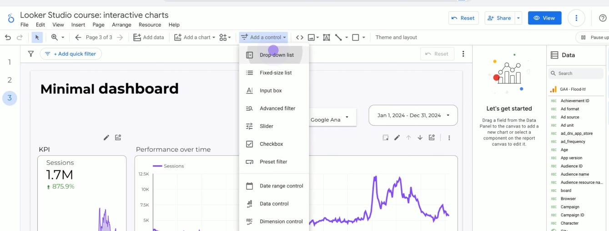

2. **Step 2 — Place the Dropdown Control on the Dashboard**

After selecting **Dropdown list**, click anywhere on the dashboard canvas to place the filter.

The dropdown control will appear as a small interactive component on the dashboard. You can move or resize this control to match the layout of your dashboard.

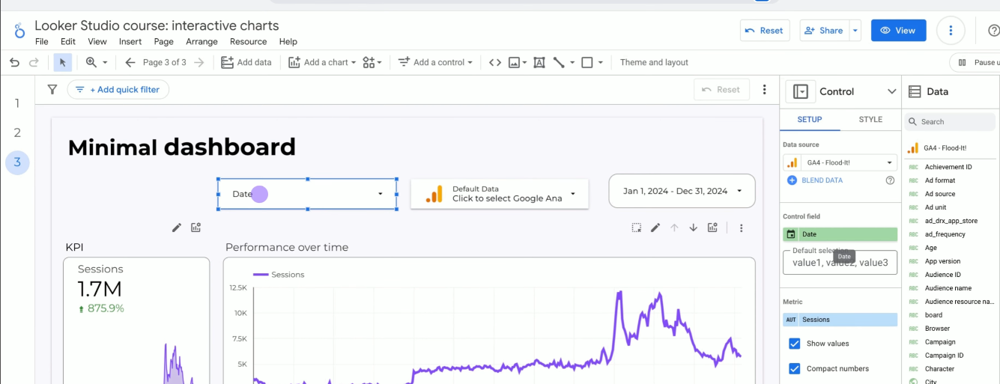

3. **Configure the Dropdown Field**

After placing the dropdown control, you need to configure what data the filter will use. On the right side of the screen, you will see the **Control settings panel**.

In this panel, look for the Control field option. This field determines which dimension will be used for filtering the data. Initially, the dropdown may use a default field such as **Date.**

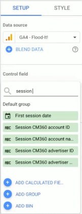

4. **Change the Filter Dimension**

To analyze acquisition channels, the filter dimension can be changed. In the **Control field** section, search for and select **Session source**.

This configuration allows the dropdown to filter the dashboard data based on different traffic sources. Once selected, the dropdown label will automatically update to **Session source**.

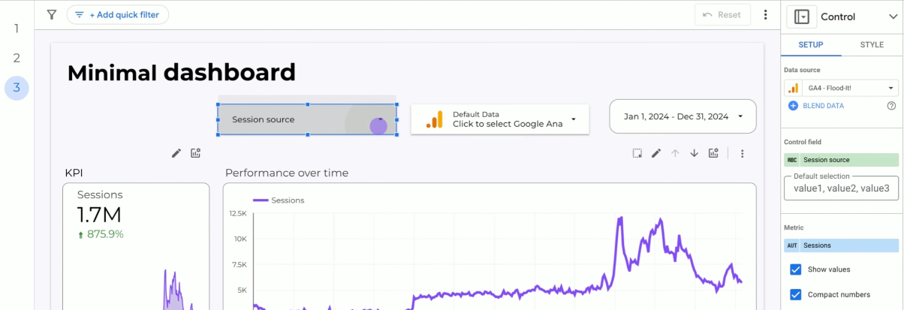

**Dropdown filters** are one of the most useful interactive controls in Looker Studio dashboards. They allow users to dynamically filter data without editing the report structure.

By selecting different values in the dropdown list, users can explore data from different perspectives and focus on the information that is most relevant to their analysis.

# Segmentation

If a dashboard contains too much information, **data segmentation in Looker Studio** can help. By using filters, data can be divided into smaller and more focused views.

For example, you can display only mobile traffic, visitors from the UK, or specific campaigns. This helps present data more clearly without overwhelming users.

This guide covers chart, page, and report-level filters, interactive filter controls, grouping filters with charts, and best practices for using filters effectively.

**WHAT IS DATA SEGEMENTATION IN LOOKER STUDIO?**

**Data segmentation** in Looker Studio means dividing data into smaller groups to focus on the most important insights, such as device type, location, or user behavior.

Looker Studio provides several filtering levels:

* **Chart-level filter** → applies to one specific chart
* **Page-level filter** → applies to all charts on a page
* **Report-level filter** → applies to the entire report

Let’s look at each in a bit more detail.

## Segment Filtering

### Chart-level filters

Use chart-level filters when you want to segment data for a single chart without affecting others.

Steps:

1. Select the chart you want to filter
2. In the Setup panel, click **Add a filter**
3. Define your condition, for example:

> `Include → Device Category → Equals → Mobile` (to show only mobile traffic)

> `Include → Page → Contains → /en/` (to focus on a specific page section)

This lets you customize one chart independently from the rest of the dashboard.

### Page-level filters

Use page-level filters when you want all charts on a page to show the same data segment, such as UK visitors.

Steps:

- Go to **Page** → **Current page settings**
- **Add a filter** in the Setup panel
- Define your filter, for example:

> Include → Country → Equals → United Kingdom

Now, every chart on the page will automatically reflect the UK data, saving you from applying the filter to each chart individually.

### Report-level filters

Use report-level filters when the whole report should focus on a single segment, such as users from a specific campaign.

Steps:

- Go to **Resource** → **Manage filters** to create your filter, or
- Go to **File** → **Report Settings** and scroll to Report Filter

Once applied, this filter applies to every chart on every page, ensuring consistent reporting throughout the report.

### Adding interactive filter controls

One great feature in Looker Studio is letting viewers segment data themselves.

Steps to add interactive controls:

- Click **Add a control** in the toolbar
- Choose a control type, like **Dropdown** or **Slider**
- Configure it to filter by a dimension, such as `Device Category` or `Country`

For example, a dropdown letting users select *Mobile*, *Desktop*, or *Tablet* makes the report interactive and easier to explore.

### Grouping filter controls with specific charts

If you want a filter control to affect only certain charts instead of the whole page, you can use grouping.

Steps:

- Select the **filter control** and the charts you want it to affect
- **Right-click** → **Group**

This limits the filter to only those selected elements, which is useful for building modular dashboards.

# Cross Interaction

Cross-interaction allows charts in a dashboard to interact with each other. Instead of manually applying filters, users can click on a chart element to automatically update other charts.

## Cross-filtering 

Dynamic cross filtering is an interactive feature in Looker Studio that links charts within a report.

When a user clicks a value in one chart (like a bar, line, or table), all other charts update automatically to show only data related to that selection.

This makes each chart act as an interactive filter.

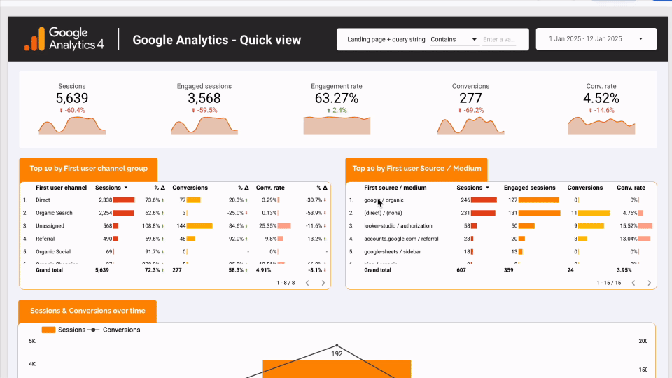

This feature lets you:

- Explore data dynamically without changing existing filters
- Create interactive dashboards
- Analyze data subsets quickly
- Make data easier to read and interpret

By default, cross filtering applies to the whole page, but you can disable it on specific charts if needed.

It does not override existing filters; it refines the currently filtered data. A reset button is also available to clear all selections at once.

## How to use

Cross filtering is enabled by default on all compatible charts in Looker Studio.

To check or change it:

- Select the chart
- Open the **Setup** tab in the right-hand panel
- Go to **Chart interactions**
- Check the **Cross-filtering** option to enable, or uncheck to disable

:::{.callout-note}
Disabling cross filtering only stops click-based filtering; it does not remove the chart’s overall filtering capability.
:::

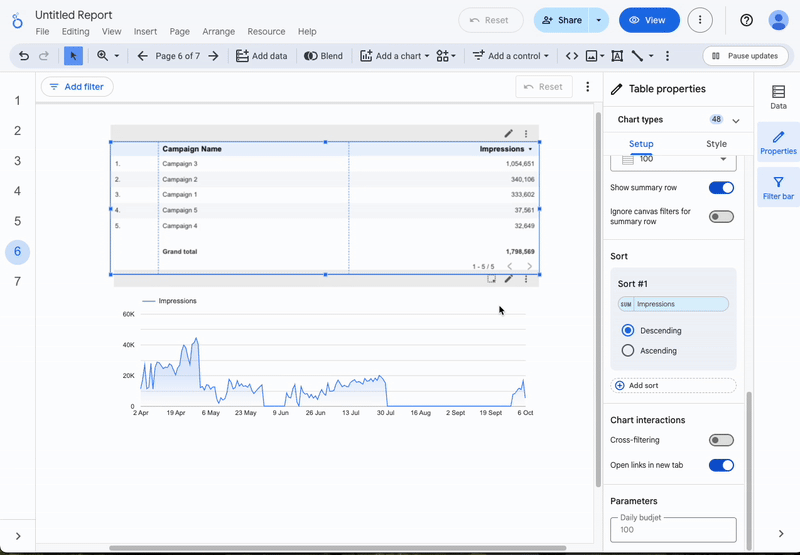

## Limitations

For cross filtering to work correctly in Looker Studio, these conditions must be met:

- Charts must use the **same data source**.
- Charts cannot be **Pivot Tables** or **Scorecards**, as these don’t trigger cross filtering.
- Cross filters do not replace global filters or controls (like date selectors); they work alongside them.

# User Exploration

A well-designed dashboard should support users who want to explore data independently. Instead of relying on static reports, users should be able to navigate the dashboard and investigate insights on their own.

## Interactive Navigation

Interactive navigation helps users move between different views or sections of a dashboard.

**Examples include:**

- Navigating between overview and detailed analysis pages
- Switching between sales and marketing dashboards
- Exploring different product segments

Navigation controls help organize complex dashboards and make them easier to use.

