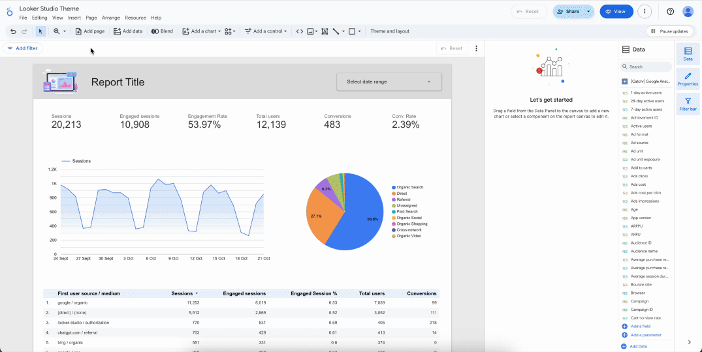
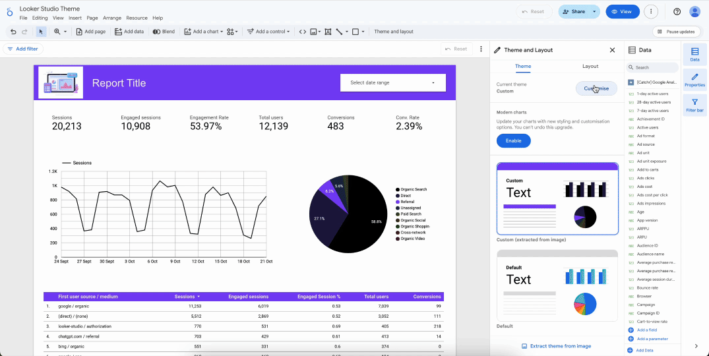
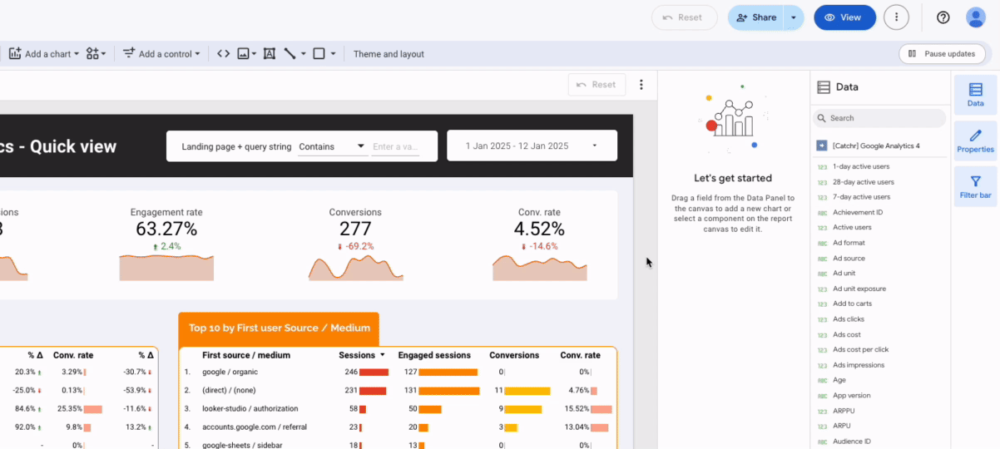
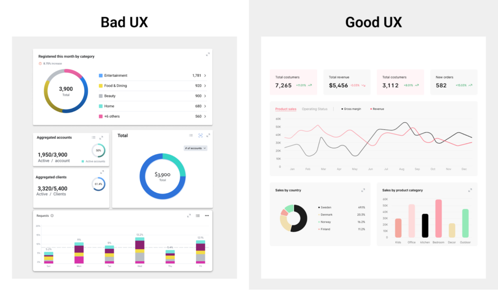
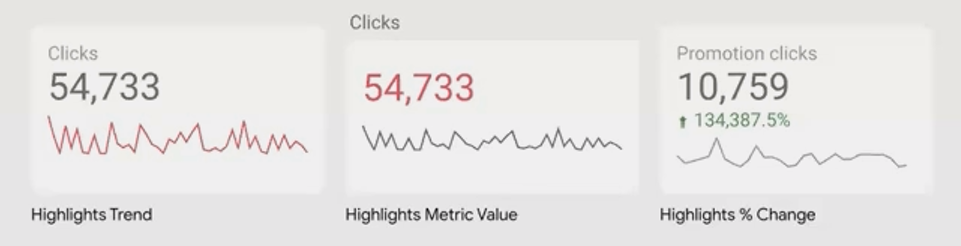
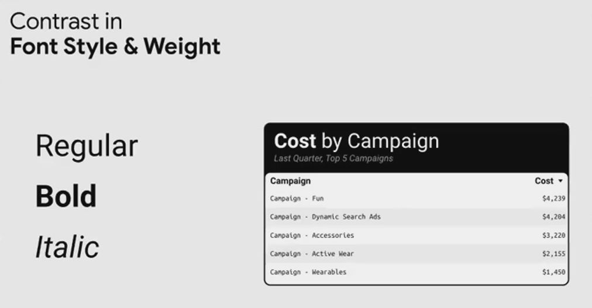

A well-designed dashboard helps users understand data quickly and accurately. Good design is not only about visual appearance but also about how information is structured and prioritized. In this section, participants will learn how to apply design principles that improve **readability**, **clarity**, and **insight delivery in a dashboard**.

# Theme & Styling 

Theme and styling help create a consistent visual identity across the dashboard. In <a href="https://lookerstudio.google.com">Looker Studio</a>, themes control colors, fonts, and visual formatting so that all components follow the same design standard.

Using a consistent theme improves clarity and prevents visual confusion. It also helps users quickly recognize patterns and important information in the dashboard.

## Theme Application

<a href="https://lookerstudio.google.com">Looker Studio</a> provides predefined themes that can be applied directly to a report. These themes include predefined color palettes, typography settings, and chart styles that automatically format the dashboard layout.

<a href="https://lookerstudio.google.com">Looker Studio</a> provides a set of default themes that any user can apply without deep configuration. To use one:

:::{.callout-note title="Use themes in Looker Studio"}

1. Open your report in **Edit mode**
2. In the top menu bar, click **File** > *Theme and layout*
3. In the right-hand panel, open the **Theme** tab
4. Choose one of the standard themes from the list

:::

That’s it. The selected theme will automatically apply to your report.

If the automatically generated theme isn’t perfect or requires adjustments, you can manually tweak each part of it. To do this:

- Select the theme you want to edit
- Click **Customize** at the top of the panel

You can then adjust:

- Main colors (accent, background, text, axes, etc.)
- Fonts (global and per element type)
- Chart styles (background color, border style, transparency, corner shape, layout, and more)

Once you achieve the desired visual result, your theme setup is complete.

# Typography

Typography refers to how text is displayed in a dashboard. In <a href="https://lookerstudio.google.com">Looker Studio</a>, typography controls the appearance of titles, labels, metrics, and descriptions. 

<a href="https://lookerstudio.google.com">Looker Studio</a> provides several built-in fonts such as Roboto, Open Sans, Arial, Montserrat, and Lato, which are commonly used in dashboards because they are clean and easy to read.

## Font Hierarchy 

In a dashboard, not all information should have the same visual emphasis. `Titles`, `key metrics`, and `labels` should have different sizes and weights so users can easily understand the structure of the report.

:::{.callout-tip title="A typical dashboard hierarchy"}

| **Level**  | **Purpose**                      | **Example**                   |
| ---------- | -------------------------------- | ----------------------------- |
| Title      | Dashboard or section heading     | “Monthly Sales Dashboard”     |
| Metric     | Important KPIs                   | Revenue, Conversion Rate      |
| Label      | Supporting information           | Category, Date, Region        |

:::

### Applying Font Hierarchy

In <a href="https://lookerstudio.google.com">Looker Studio</a>, font settings can be adjusted through the Theme and Layout panel or directly within each chart component.

Basic steps to modify typography:

1. Select a chart or text element.
2. Open the Style panel on the right side.
3. Choose the font family, font size, and font weight.
4. Apply consistent settings across titles, metrics, and labels.

Typography in dashboards is like good plumbing – when it’s done right, nobody notices it, but when it’s wrong, everything breaks down.

Font Hierarchy Guidelines:

- **Headers**: 24-32px, bold weight, short and descriptive
- **Subheaders**: 16-20px, medium weight, contextual information
- **Body/Data**: 12-14px, regular weight, high readability
- **Annotations**: 10-12px, light weight, supplementary details

**Font Choice**: Stick to system fonts or widely supported web fonts. Avoid decorative fonts in data contexts – readability trumps personality every time.

# Color Strategy

Color is one of the most powerful visual elements in dashboard design. Effective dashboards usually rely on a limited color palette. 

Using too many colors can create visual noise and make it difficult for users to focus on the most important information.

## Primary vs Accent Colors

Color hierarchy in dashboards typically consists of primary colors and accent colors. Each color plays a different role in guiding user attention.

### Primary Colors

Primary colors represent the main visual identity of a dashboard. They are used consistently across charts, titles, and interface elements to create a unified appearance.

Primary colors usually reflect the organization’s brand color and serve as the dominant color throughout the report. Because they appear frequently, they should remain visually balanced and not overly saturated.

In <a href="https://lookerstudio.google.com">Looker Studio</a> dashboards, primary colors are commonly used for:

- Main data series in charts
- Section titles or headers
- Key interface elements

Using the same primary color consistently helps users build familiarity with the dashboard structure.

### Accent Colors

Accent colors are used sparingly to highlight important insights. Because they appear less frequently than primary colors, they naturally attract attention.

Accent colors are often applied to elements that require immediate focus, such as KPI indicators, alerts, or significant changes in performance.

For example:

- Red may highlight negative performance
- Green may indicate positive growth
- Orange or yellow may signal warnings or attention areas

Since accent colors draw strong visual attention, they should be used carefully and only for critical insights.

---

Applying Color Hierarchy in Dashboards

A practical approach for dashboard color usage is the 60-30-10 rule:

:::{.callout-tip title="Color Rule"}

| **Usage** | **Color Role**     | **Example**               |
| --------- | ------------------ | ------------------------- |
| 60%       | Neutral colors     | Background, gridlines     |
| 30%       | Primary color      | Main charts               |
| 10%       | Accent colors      | KPIs, alerts              |

:::

Visual seperti ini sangat efektif untuk training dashboard design.

# Layout Structure 

Layout structure is the way charts, filters, and text are arranged in a dashboard. A good layout helps users read and understand the information easily.

In most dashboards, KPIs are placed at the top, followed by charts and supporting tables. This order helps users see the main results first before looking at more detailed data.

A balanced layout also makes the dashboard clearer and easier to read.

## Grid Alignment

Grid arrangement is a layout technique used to place dashboard elements along consistent horizontal and vertical lines. It helps charts, filters, and text appear balanced and easy to read.

In <a href="https://lookerstudio.google.com">Looker Studio</a>, using a grid keeps the spacing between elements consistent. When components are aligned, the dashboard looks more professional and easier to understand. Misaligned elements can make the dashboard look messy and harder to read.

A common dashboard layout structure follows this arrangement:

| **Section**        | **Content**                                   |
| ------------------ | --------------------------------------------- |
| Top Section        | KPI cards and summary metrics                 |
| Middle Section     | Main charts showing trends or comparisons     |
| Bottom Section     | Detailed tables or supporting data            |

Several design practices help create balanced dashboards:

| **Principle**             | **Description**                               |
| ------------------------- | --------------------------------------------- |
| Consistent spacing        | Maintain equal distance between charts        |
| Visual grouping           | Place related charts close together           |
| Top-down hierarchy        | Show summary information first                |
| Balanced distribution     | Avoid placing too many charts in one area     |

# Visual Hierarchy

Visual hierarchy refers to the arrangement of dashboard elements according to their importance. It guides users to see the most important information first and then move toward supporting details in a logical order.

In dashboard design, visual hierarchy acts as a visual roadmap that directs the user's attention through the report. Without a clear hierarchy, users may feel overwhelmed and struggle to understand which metrics matter most.

:::{.callout-note title="Effective visual hierarchy"}

- Direct attention to the most important metrics
- Create a clear flow when reading the dashboard
- Reduce cognitive load when interpreting data

:::

When hierarchy is applied properly, users can quickly identify key insights without needing to analyze every chart individually.

## KPI Highlighting

Key Performance Indicators (KPIs) represent the most critical metrics in a dashboard. Because these metrics are directly related to business performance, they should be visually emphasized.

Visual hierarchy can highlight KPIs using several design techniques.

### Size Emphasis

One simple way to create visual hierarchy is by using different sizes for elements.

- Display main KPIs in a larger size than other metrics
- Use bigger charts for the most important data
- Apply larger font sizes for titles and key numbers

Larger elements usually attract attention first, which helps users quickly identify the most important information on the dashboard.

### Contrast and Color

On light dashboard backgrounds, darker colors create stronger contrast, so they usually appear more important.

- Use darker colors for primary data
- Use lighter colors for secondary information
- Keep gridlines or borders **less bright** so they don’t distract from the main data

Research also shows that high-contrast elements can be recognized faster by the human brain.

**Color saturation** refers to how strong or intense a color appears.

- **High saturation** attracts attention and highlights important data
- **Low saturation** is better for supporting information
- **Grayscale colors** usually appear the least important

By adjusting color saturation, designers can create a **clear visual hierarchy** in a dashboard.

### Typography Emphasis

Typography also plays an important role in creating visual contrast in a dashboard.

- **Bold text** is usually used to highlight important information or key values, because it stands out more clearly than other text.
- **Regular text** is suitable for most content, such as descriptions or standard labels.
- **Italic text** is commonly used for notes, annotations, or additional information that supports the main content.

Studies using eye-tracking technology show that bold text can be processed about 11% faster than regular text in dashboard environments. For this reason, bold formatting is often used for the most important labels and values.

### Positioning

Dashboard viewers typically scan reports from top to bottom and left to right. For this reason, primary KPIs should be positioned at the top section of the dashboard so users can see them immediately.

---

When these techniques are applied together, dashboards clearly communicate which metrics represent the most important insights.

