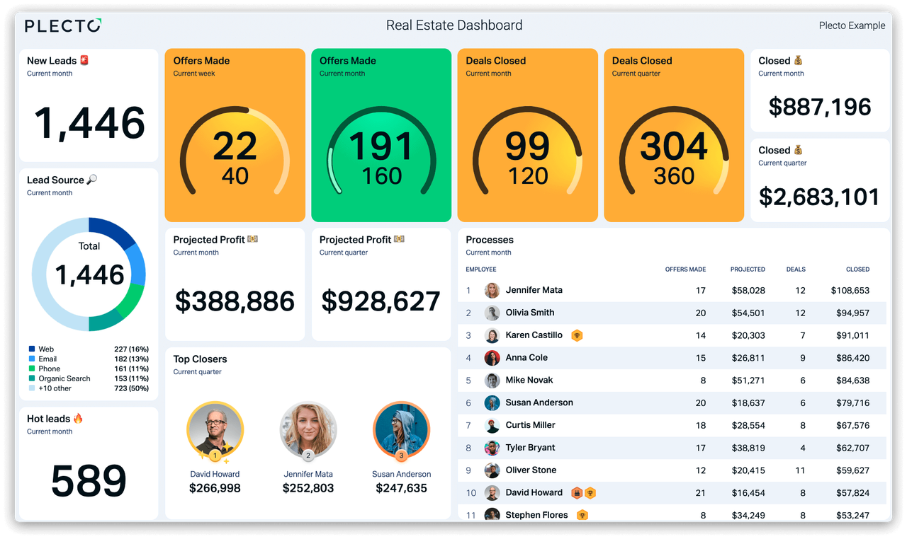

Live real estate dashboards allow agencies and managers to monitor KPIs and performance in real time. This helps decision-makers access important metrics quickly without waiting for reports.

With a dashboard, teams can easily track lead conversions, pending contracts, sales performance, marketing ROI, cost per lead, and progress toward revenue targets.

Overall, the dashboard provides a quick overview of the agency’s performance for both employees and management.

# Sales Dashboard 

## Revenue Tracking
## Unit Conversion  
## Project Comparison
## Funnel View

---

# Marketing Dashboard

## Channel ROI
## Cost Efficiency
## Lead Quality
## Campaign Impact

---

# Interactive Logic

## Cross Filters
## Drill Paths
## Context Control
## User Navigation

---

# Property Performance

## Inventory Status 
## Utilization Rate
## Revenue Mix 
## Performance Gap

